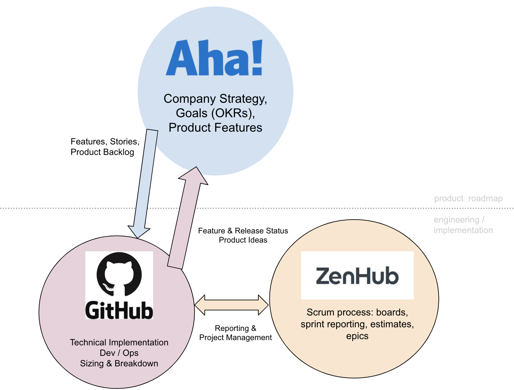
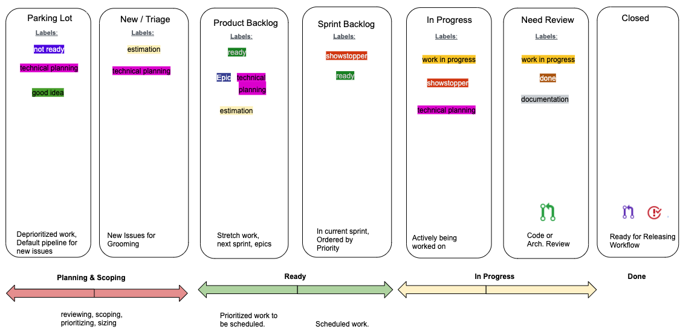

# Issue Flow

Our product roadmap is managed in Aha. Quarterly goals (OKRs) are broken down into Features, which are further broken down into user stories. They are planned and slotted quarterly in Aha. Once they are ready to be scheduled, they are sent to Github/Zenhub for technical planning.

In Github, features and stories are broken down into sub-issues, sized, and connected via Zenhub's epic functionality. This provides overall progress tracking on groups of related issues, and is fed back to Aha's roadmap planning tools.

## Zenhub

Zenhub is agile sprint management software with a UI that sits on top of the Github UI, adding fields to Github. Install the Zenhub plugin for Firefox or Chrome to work with Zenhub right in Github.

* Epics: collections of related stories / issues
* Dependency relationships between issues and epics
* sprint boards
* estimating and reporting (burn-downs, releases, etc.)

In Zenhub, [OKRs](https://rework.withgoogle.com/guides/set-goals-with-okrs/steps/introduction/) are connected to Zenhub releases. Zenhub's reporting tools provide progress and timeline projections to stakeholders and product owners on OKRs during the quarter.

## Board Organization and Workflow

Our sprint board and labeling workflow are intended to be simple, flexible, and tightly coupled to where the actual work is being done: Github. The PM/SM role performs regular, daily management of issues and sprint boards so that our engineers can be focused on development, implementation, and code reviews.

Zenhub "Releases" are a container in Zenhub for grouping related issues belonging to a body of work that spans multiple sprints. It is an abstract grouping for reporting purposes and not specifically tied to code releases. `Releases` might be thought of as `projects`: we use them to track OKRs.

Releases contain epics, issues, and PRs. An epic is a large feature, and contains a collection of user stories that can be broken down into specific tasks. Epics group and track progress against multiple, related, child issues in Github. Once all of its child issues are completed and closed, then an epic can be closed.

Issues are smaller features, tasks, or bugs. They typically contain 1-2 user stories. They are closed when a related and linked Pull Request is merged to master.

## Labels and Board Pipelines

Labels reflect the status of particular issue and make that status highly visible on boards. We try to keep them general and consistent across all DDEV-Live repos, preferably assigning 1 label at a time. (There are occasional exceptions). The Board pipelines reflect where an issue is in the feature development lifecycle. We ID each sprint with the convention `YYYY-Quarter-sprintnumber`. All issues in the current sprint are assigned that sprint ID using the milestone field in Github. This allows for quick filtering of boards to the current and future sprints.

 The labeling workflow and the board workflow work in parallel and align with the [Definitions of Ready and Done](dor-dod-raci.md).

## Labels

| Label | Sets Label | Indicates |
|-|-|-|
| Documentation | Product / Engineering | Needs to be documented |
| Good Idea | Product / Engineering | Worthy of roadmap consideration |
| Not Ready | Product / Engineering | Isn't actionable or needs definition (user stories, A/C, etc.) |
| Technical Planning | Product / Engineering | Issue needs technical implementation plan |
| Estimation | Product / Engineering | Ready for Poker Planning |
| Ready | Product | Meets Definition of Ready |
| Showstopper | Product / Engineering | Urgent hot fix needed; bypasses DoR |
| Work In Progress | Engineering | Work is underway in current sprint |
| Done | Engineering | Meets Definition of Done; needs review before closing |
| Epic | Zenhub | Issue is an epic |

## Typical Github Workflow
1. Select an issue in the current sprint on the Board. It may be assigned already, or unassigned.
2. When starting, change the label from `Ready` to `Work in Progress`.
3. PR against it. A PR can be linked to the issue [in the PR description](https://docs.github.com/en/enterprise/2.16/user/github/managing-your-work-on-github/closing-issues-using-keywords), in the Zenhub PR connect field, or in the Github `Linked issues` field. Any of these will connect the PR to the issue.
4. Use any of these options if the PR is still a work-in-progress:
    - use [GH's draft PR functionality](https://github.blog/2019-02-14-introducing-draft-pull-requests/)
    - Set the `Work in Progress` or `Not Ready` labels
    - Put `WIP` in your PR title
5. When the PR is approved and ready for merge, validate its acceptance criteria, user stories in the related issue by checking them off.
6. Depending on the method of PR connection in step 3, a merged PR will automatically close its linked issue and move to the `Closed` pipeline. If the issue is completed but not automatically closed, close it manually.
7. If an issue is completed but requires sign-off from a product owner before closing, set the label to `done` and put it in the `Needs Review` pipeline.
8. Issues can and do have multiple PRs associated. An issue remains open on the board with merged PRs linked to it when it is still in progress and there is more work coming.

## Issue Sizing
We use a modified version of the [Fibonacci scale](https://en.wikipedia.org/wiki/Fibonacci_scale_(agile)) to relatively size our issues in Slack, asynchronously. A how-to is posted in the channel.
